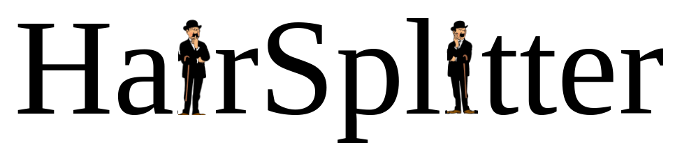

Splits contigs into their different haplotypes (or repeats into their different versions).

*For developers working on similar problems:* HairSplitter is puposefully built as a series of modules that could be integrated in other software. See the [How does it work section](#work) and do not hesitate to contact me.

# What is Hairsplitter ?

`Hairsplitter` takes as input an assembly (obtained by any means) and the long reads (including high-error rate long reads) used to build this assembly. For each contig it checks if the contig was built using reads from different haplotypes/regions. If it was, `Hairsplitter` separates the reads into as many groups as necessary and computes the different versions (e.g. alleles) of the contig actually present in the genome. It outputs a new assembly, where different versions of contigs are not collapsed into one but assembled separately.

# Why is it useful ?

`Hairsplitter` can be used to refine a metagenomic assembly. Assemblers commonly collapse closely related strains as on single genome. HairSplitter can recover the lost strains. The uncollapsed parts of the assembly are left as is.
`HairSplitter` is also useful for single-organism assembly, especially if you are trying to obtain a phased assembly. The main advantage of `Hairsplitter` compared to other techniques is that it is totally parameter-free. Most importantly, it does not requires to know the ploidy of the organism, and can infer different ploidies corresponding to different contigs. It can thus be used just as well on haploid assemblies (to improve the assembly of duplications) as on complex allotetraploids (to assemble separately the haplotypes). Just run the assembly through!

# Installation

You can install HairSplitter through conda `conda install -c bioconda hairsplitter`

## Dependencies

### List of dependencies

- [minimap2](https://github.com/lh3/minimap2)
- [racon](https://github.com/isovic/racon) and/or [medaka](https://github.com/nanoporetech/medaka)
- [samtools](www.htslib.org)
- [raven](github.com/lbcb-sci/raven)
- CMake >= 3.8.12, make, gcc >= 11, g++ >= 11
- Openmp
- Python3 with numpy and scipy
- gzip

If Minimap2, Racon, Medaka or samtools are not in the PATH, their location should be specified through the `--path-to-minimap2`, `--path-to-racon`, `path-to-medaka` or `--path-to-samtools` options.
 
### Quick conda dependencies

The recommended way to install HairSplitter is to create and activate a conda environment with all dependencies: 
```
conda create -c bioconda -c conda-forge -c anaconda -n hairsplitter cmake gxx gcc python scipy numpy minimap2 minigraph=0.20 racon "samtools>=1.16" raven-assembler openmp
conda activate hairsplitter

conda install -c bioconda -c conda-forge medaka #only if you specifically want to use medaka /!\ Very heavy installation
```
 
## Download & Compilation

To download and compile, run
```
git clone https://github.com/RolandFaure/Hairsplitter.git
cd Hairsplitter/src/
mkdir build && cd build
cmake ..
make
```

# Usage

## Quick start

Let's say `reads.fastq` (ONT reads) were used to build assembly `assembly.gfa` (with any assembler)(the assembly can be in gfa or fasta format). To improve/phase the assembly using `Hairsplitter`, run
```
python /path/to/hairsplitter/folder/hairsplitter.py -f reads.fastq -i assembly.gfa -x ont -o hairsplitter_out/
```

In the folder hairsplitter\_out, you will find the new assembly, named `hairsplitter_final_assembly.gfa`. Another generated file is `hairsplitter_summary.txt`, in which are written which contigs are duplicated and merged.

You can test the installation on the mock instance provided and check that HairSplitter exits without problems.
```
python hairsplitter.py -i test/simple_mock/assembly.gfa -f test/simple_mock/mock_reads.fasta -o test_hairsplitter/ -F
```

## Options

```bash
usage: hairsplitter.py [-h] -i ASSEMBLY -f FASTQ [-c HAPLOID_COVERAGE]
                       [-x USE_CASE] [-p POLISHER] [--correct-assembly]
                       [-t THREADS] -o OUTPUT [--resume] [-s] [-P] [-F] [-l]
                       [--clean]
                       [--rarest-strain-abundance RAREST_STRAIN_ABUNDANCE]
                       [--minimap2-params MINIMAP2_PARAMS]
                       [--path_to_minimap2 PATH_TO_MINIMAP2]
                       [--path_to_minigraph PATH_TO_MINIGRAPH]
                       [--path_to_racon PATH_TO_RACON]
                       [--path_to_medaka PATH_TO_MEDAKA]
                       [--path_to_samtools PATH_TO_SAMTOOLS]
                       [--path_to_python PATH_TO_PYTHON]
                       [--path_to_raven PATH_TO_RAVEN] [-v] [-d]

optional arguments:
  -h, --help            show this help message and exit
  -i ASSEMBLY, --assembly ASSEMBLY
                        Original assembly in GFA or FASTA format (required)
  -f FASTQ, --fastq FASTQ
                        Sequencing reads fastq or fasta (required)
  -c HAPLOID_COVERAGE, --haploid-coverage HAPLOID_COVERAGE
                        Expected haploid coverage. 0 if does not apply [0]
  -x USE_CASE, --use-case USE_CASE
                        {ont, pacbio, hifi,amplicon} [ont]
  -p POLISHER, --polisher POLISHER
                        {racon,medaka} medaka is more accurate but much slower
                        [racon]
  --correct-assembly    Correct structural errors in the input assembly (time-
                        consuming)
  -t THREADS, --threads THREADS
                        Number of threads [1]
  -o OUTPUT, --output OUTPUT
                        Output directory
  --resume              Resume from a previous run
  -s, --dont_simplify   Don't merge the contig
  -P, --polish-everything
                        Polish every contig with racon, even those where there
                        is only one haplotype
  -F, --force           Force overwrite of output folder if it exists
  -l, --low-memory      Turn on the low-memory mode (at the expense of speed)
  --clean               Clean the temporary files
  --rarest-strain-abundance RAREST_STRAIN_ABUNDANCE
                        Limit on the relative abundance of the rarest strain
                        to detect (0 might be slow for some datasets) [0.01]
  --minimap2-params MINIMAP2_PARAMS
                        Parameters to pass to minimap2
  --path_to_minimap2 PATH_TO_MINIMAP2
                        Path to the executable minimap2 [minimap2]
  --path_to_minigraph PATH_TO_MINIGRAPH
                        Path to the executable minigraph [minigraph]
  --path_to_racon PATH_TO_RACON
                        Path to the executable racon [racon]
  --path_to_medaka PATH_TO_MEDAKA
                        Path to the executable medaka [medaka]
  --path_to_samtools PATH_TO_SAMTOOLS
                        Path to samtools [samtools]
  --path_to_python PATH_TO_PYTHON
                        Path to python [python]
  --path_to_raven PATH_TO_RAVEN
                        Path to raven [raven]
  -v, --version         Print version and exit
  -d, --debug           Debug mode

```

# Issues
 Most installation issues that we have seen yet stem from the use of too old compilers. Hairsplitter has been developed using gcc=11.2.0. Sometimes the default version of the compiler is too old (especially on servers). Specify gcc versions manually to cmake using `-DCMAKE_CXX_COMPILER=/path/to/modern/g++` and `-DCMAKE_C_COMPILER=/path/to/modern/gcc`.
 
 <a name="work">
</a>

# How does it work ?

HairSplitter is organized as series of modules, some of these modules being of independant interest. The full documentation can be found in the doc/ folder.

1. *Cleaning the assembly* Ideally, the assembly would be purged of all assembly errors. In practice, ensure there is no over-duplication by deleting unconnected contigs that align very well on other contigs.

2. *Calling variants* Variants are called using an alignment of the reads on the assembly. For now, a basic pileup is used. Calling variants in a metagenomic context is hard: favor calling false variants over missing true variants - the false variants will be filtered afterward.

3. *Filtering variants* This step is crucial. Each called variant partition the reads in groups. Keep only variants which partition occur frequently, because this cannot be chance. This way, only very robust variant are kept.

4. *Separating the reads* Based on the robust variants, HairSplitter inspect each contig and determine if several distinct groups of reads align there. If it is the case, it means that several different versions of the contig exist.

5. *Creating the new contigs* Create every new contig by polishing the existing contig using the several groups of reads.

6. *Improving contiguity* Contigs are generally separated only locally. To improve contiguity, use the long reads that align on several contigs sequentially.
 
# Citation
 Please cite the preprint on bioRxiv: [https://www.biorxiv.org/content/10.1101/2024.02.13.580067v1](https://www.biorxiv.org/content/10.1101/2024.02.13.580067v1)
 
 


